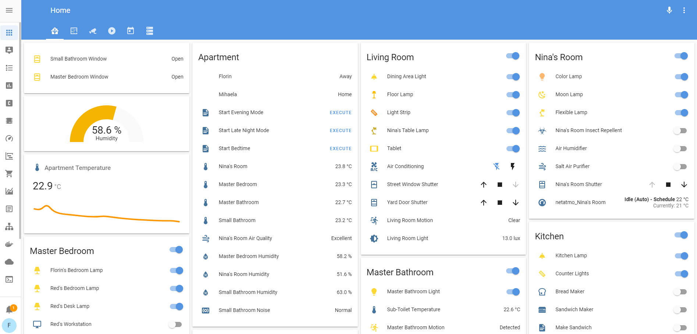
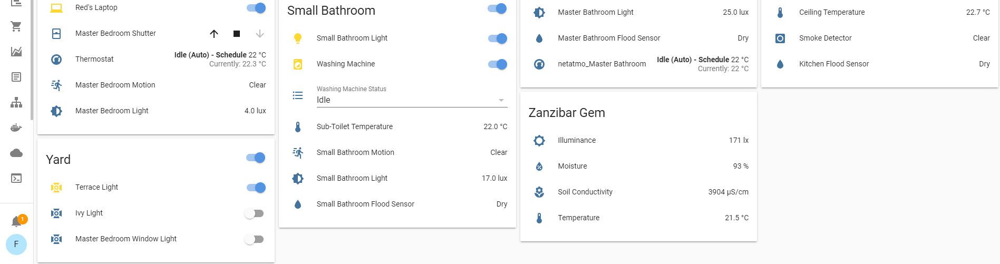
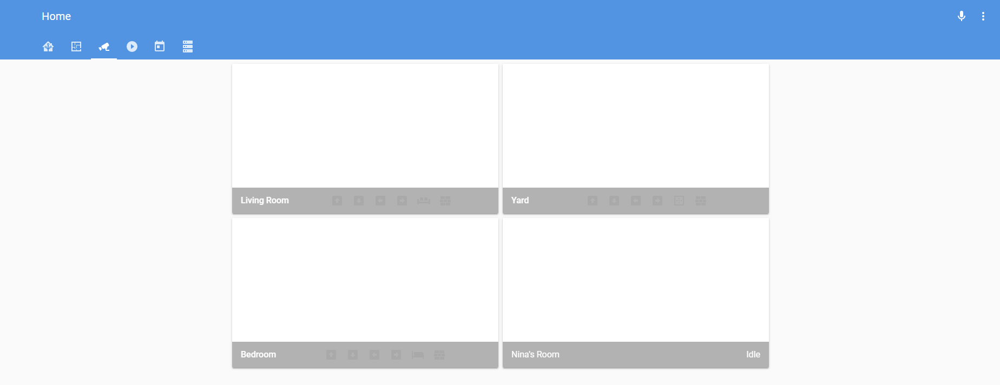
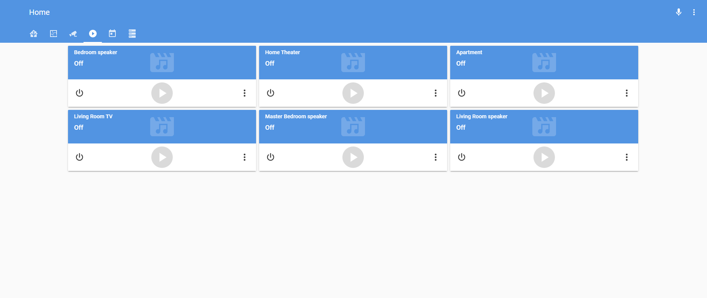
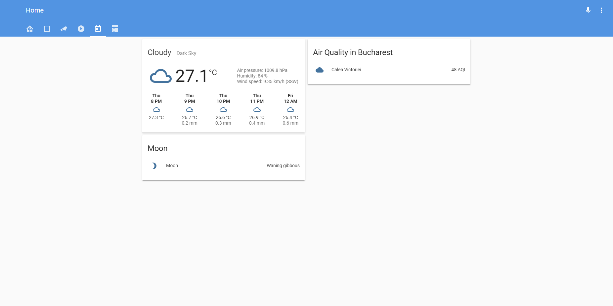
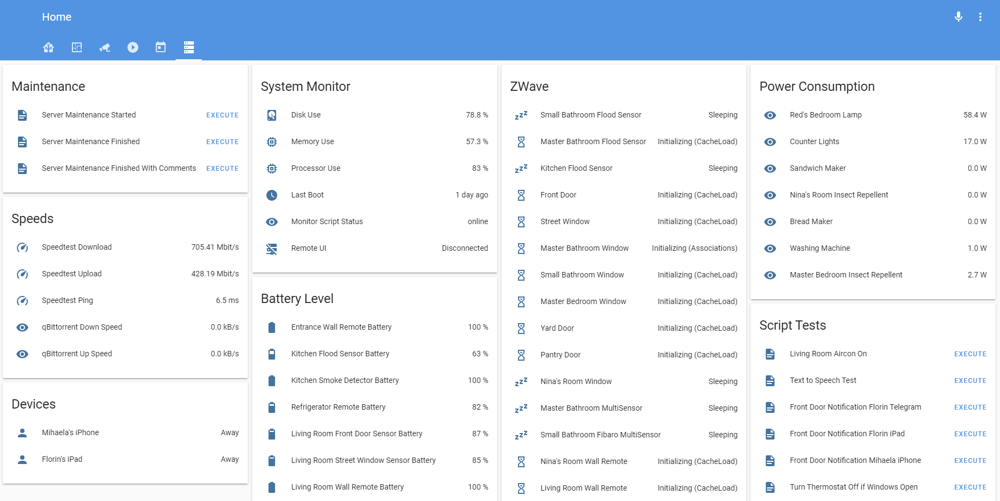
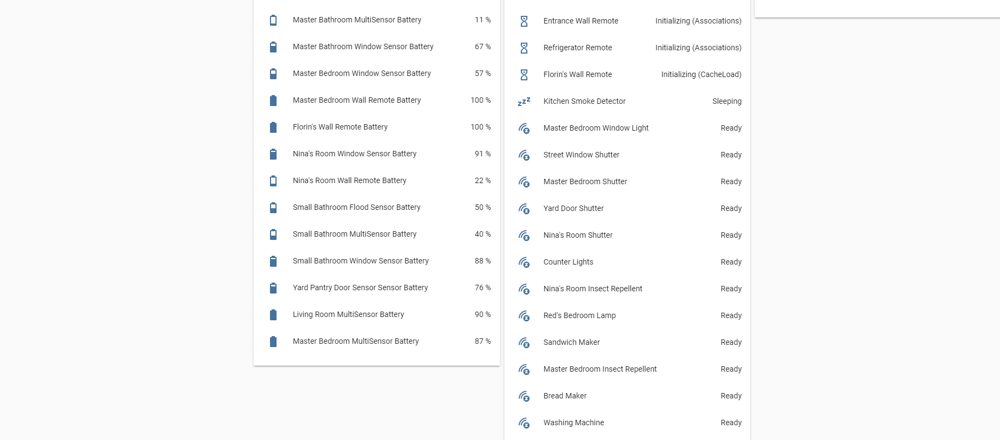
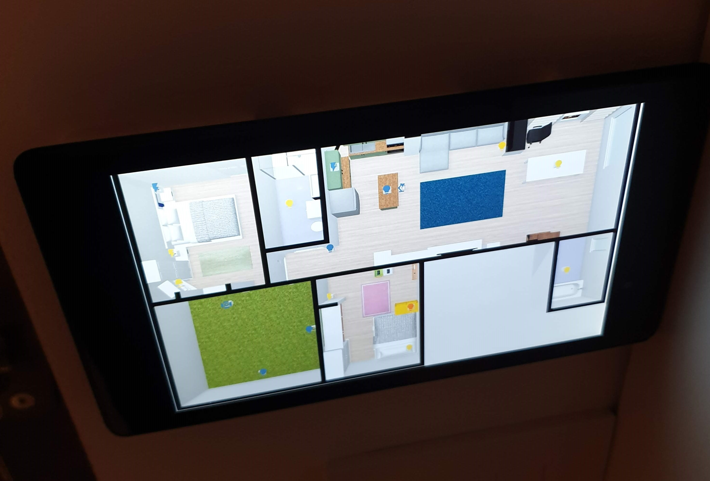

# My Home as powered by Home Assistant

Since discovering Home Assistant in the summer of 2018, it has become my favorite hobby. 

# Infrastructure 

<b> Network hardware: </b>

- Linksys WRT1200AC Gigabit router
- Linksys SE4008 Gigabit switches

<b> Server hardware: </b>

- DELL Optiplex 990 SFF (for everything except NAS & presence detection)
  - Intel Core i5 2400 (2nd gen - Sandy Bridge) 3.4GHz
  - 20GB DDR3-1333 RAM (2x8GB + 2x2GB)
  - 240GB WD Green SSD
  - Conbee Zigbee USB adapter
  - ZWAVE.ME UZB ZWave USB adapter
  - APC Back-UPS 700VA UPS

- Raspberry Pi 3B+ (for presence detection)
  - 120GB Kingston UV500 mSATA SSD
  - 2.5A RPi PSU
  - 8MP PiNoir2 Camera

- Desktop PC (for gaming & NAS)
  - Intel Pentium G4400 (6th gen - Skylake) 3.3GHz
  - ASRock B150M Pro4S/D3 MB
  - 16GB DDR3-1600 RAM (4x4GB)
  - ASUS GeForce GTX1050 Ti 4GB GDDR5
  - 480GB WD Green SSD
  - 11TB HDD (4x2TB + 1x3TB)
  - 650W Seasonic Focus GX PSU
  - Fractal Design Node 804 case

<b> Misc. hardware: </b>

- Xbox One S
- Nvidia Shield 2015
- Logitech Harmony Home Hub + remote
- AV receiver
- iPhone 8, iPad Mini, Samsung S9, Samsung Tab A6

<b> Software: </b>

- DELL Optiplex 990 SFF
  - Windows 10
  - Blue Iris
  - Oracle Virtualbox
  - Ubuntu Server 18.04 VMs
  - HASS.IO
  - DeConz
  - Plex Media Server
  - QBittorrent
  - healthchecks.io CRON job for notifying of downtime via Telegram

- Rapsberry Pi 3B+
  - Raspbian
  - Monitor script
  - Pi-Hole
  - healthchecks.io CRON job for notifying of downtime via Telegram

- Desktop PC
  - Windows 10

- Nvidia Shield 2015
  - Plex client
  - Steam Link 

- iOS devices:
  - HA official 2.0 app
  - Telegram
  - Blue Iris  

- Android devices:
  - HA official 1.0 app
  - Telegram
  - Blue Iris
  - Logitech Harmony
  - Linksys Smart Router
  - Google Home

<b> Security: </b>

- NGINX
- MAC filtering
- WPA2

# HASS.IO addons

- ESPHome: for connecting to my Bluetooth sensors via a NodeMCU ESP32 board
- Glances: for system monitoring
- Grafana: for visualisations of sensor history, power usage fingerprinting, etc.
- Grocy: for grocery & other consumables management
- HASS.IO Google Drive Backup: for backup of the entire HA instance to my Google Drive
- InfluxDB: for collecting sensor data to be consumed by Grafana
- Log Viewer: for easier HA log viewing
- Mosquitto Broker: for connecting things to HA via MQTT (like the Monitor script for presence detection)
- Nginx Proxy Manager: for access to the outside world without exposing ports (some addons still don't support Ingress and might never do so)
- Portainer: for easy Docker container viewing and management
- SSH & Web Terminal: for access to the HassOS instance 
- Samba share: for access to the config files from other PCs
- Tautulli: for Plex viewing stats
- Visual Studio Code: for config file editing from anywhere

# Lovelace UI screenshots

The .yaml for both Lovelace & other config files can be found in the files in this repo. 

<b> 1. The main page </b>

- a conditional card, with my currently open doors & windows
- a gauge card, which I use for humidity at the moment
- a graph card, which features the living room temperature
- the various rooms, with hardware such as:

  - ZWave power plugs (Fibaro)
  - ZWave flood sensors (Fibaro)
  - ZWave smoke sensor (Fibaro)
  - ZWave siren (Aeotec)  
  - ZWave window covers (Fibaro)
  - ZWave sensors for temperature, humidity, motion, light level (Fibaro & Aeotec)
  - Zigbee power plugs (IKEA Tradfri)
  - Zigbee light bulbs (Philips Hue, IKEA Tradfri)
  - Bluetooth LE presence detection (via Tile tags)
  - Bluetooth LE temperature & humidity sensors (Xiaomi Mijia)
  - Bluetooth LE plant sensor (Mi Flora)  
  - WiFi air quality sensor (Broadlink A1 for VOC)
  - WiFi air conditioning control via IR (Broadlink RM Mini)
  - WiFi light bulbs, light strip & desk lamp (Xiaomi Yeelight)
  - WiFi noise sensor (Broadlink A1)
  - WiFi thermostat and radiator valves (Netatmo) 
  

<b> 2. The camera page </b>

- most of the cameras are ONVIF standard, with PTZ
- a script turns them around to the wall based on presence detection, for privacy while in the house
- the REST platform is used for PTZ movements (cheap Chinese cameras, improperly supported at the moment) 
- the camera cards have buttons on them for position movement & presets

<b> 3. The media player page </b>

- several Google Home Minis
- Chromecast Audio connected to home theater
- Chromecast Ultra connected to TV

<b> 4. The "Today" page </b>

- WAQI sensor for city air quality
- moon phases
- local weather

<b> 5. The System Administration page </b>

- scripts for notifying users that maintenance is occurring on the server
- Speedtest for Internet stats
- qBittorrent plugin for current DL/UL speeds
- device location based on iOS app
- CPU, RAM, SSD usage
- Time since last VM reboot
- status of Monitor script used on a separate Raspberry Pi 3B+ for presence detection
- Nabu Casa remote UI status
- template sensors for ZWave device battery levels
- ZWave entities for monitoring their status (especially on HASS.IO restart)
- ZWave power plug consumption
- Script testing area

# Tablet

In order for my kid to be able to change light colors or turn lights on/off, I use this setup:

<b> Hardware: </b>

- Nexus 7 2013 tablet (only model ever made with wireless charging, as far as I know)
- Samsung EP-PG900 wireless charger (had it available already, useful for being relatively slim)
- 3M Command velcro strips (rated for 5.4 kg max. weight support)

<b> Software: </b>

- floorplanner.com for the apartment layout design (love the fact that they have IKEA furniture in their database, so you can find precisely what you have in your house if you're an IKEA fan)
- Lovelace picture-elements card for displaying the layout
- Compact Custom Header (CCH) addon for getting rid of the HASS.IO toolbars
- Fully Kiosk Browser for displaying the browser page with the layout in full-screen mode, with wallpaper-based screensaver turned on (only way I found to have a decent screensaver always on - both while the tablet is charging and when it isn't)

<b> Result: </b>

# Automations (Under Construction)

- Outdoor Lights Morning & Evening Modes: At sunrise and sunset (+15 mins), the outdoor lights are turned on or off
- Master Bedroom Morning Mode: Every weekday at 6:45, the bedroom window shutter is opened 50%
- Master Bedroom Day Mode: Every weekday at 7:15, the bedroom window shutter is fully opened
- Living Room Morning Mode: Every day at 6:00, the living room window shutter is fully opened
- Set dark theme for the night: HA's theme gets changed to a light one at 7:00 AM
- Set light theme for the day: HA's theme gets changed to a dark one at 9:00 PM

# Scripts (Under Construction)

- Evening Mode: Turns on various lights and closes window shutters on demand via Google Home
- Make Sandwich: Turns on the sandwich maker's smart plug and keeps it on for 6 minutes (the amount of time needed to make a sandwich on my particular sandwich maker)
